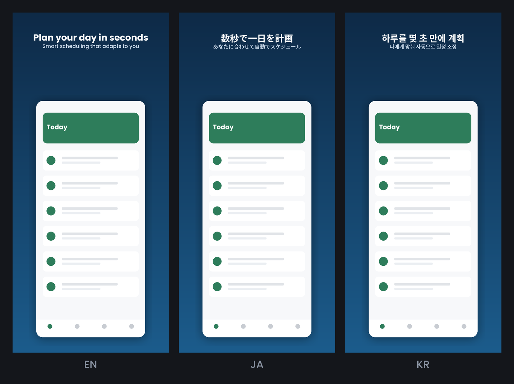

# Shotsmith

A lightweight, local-first **App Store screenshot studio** that runs entirely in your browser.
Drop in your simulator screenshots, add a title and subtitle, and export **store-ready files at exact
App Store dimensions** — with built-in **English / Japanese / Korean** localization.

No accounts. No cloud. No tracking. Everything runs locally in the browser.



📖 **[User Manual](MANUAL.md)** · 🚀 **[Deploy guide](DEPLOY.md)**

## Features

- **Exact App Store dimensions** — iPhone 6.9″ (1320×2868) and iPad 13″ (2064×2752), pixel-perfect.
- **No-alpha PNG export** — strips the alpha channel that browsers add by default, so App Store
  Connect won't reject your uploads. (JPEG export also available.)
- **EN / JA / KR localization** — write title/subtitle per language; Japanese and Korean render with
  bundled **Noto Sans JP / KR** fonts (no "tofu" boxes on any OS). Empty JA/KR fields fall back to EN.
  The **tool interface itself** also switches language with the tab (EN / 日本語 / 한국어).
- **Top-text layout** with gradient or solid backgrounds, adjustable text size, color, text area,
  corner radius, drop shadow, a **Fit / Fill** toggle for screenshot sizing (aspect ratio preserved),
  and a **Trim top** control to cleanly remove the simulator status bar.
- **Up to 10 slides**, one screenshot set per device.
- **Batch export** — "Export all" outputs every slide × device × language in one go.

## Usage

1. Open `index.html` (see "Running locally" below) or visit the hosted demo.
2. Pick a language tab (EN / 日本語 / 한국어) and type your title + subtitle.
3. Drag your iPhone and iPad screenshots into the two drop zones.
   - The same screenshot is reused across languages — only the text is translated.
4. Tweak background, colors, and layout to taste.
5. Click **Export all**. Files are named `{lang}_{device}_{NN}.png`
   (e.g. `ja_iphone_01.png`) — drop them straight into App Store Connect's per-language slots.

### A note on store copy
Apple requires overlay text to be **descriptive and factual**. Avoid superlatives, rankings,
awards, or competitor comparisons ("best", "#1", etc.) — they can get your screenshots rejected.

## Running locally

Because the fonts load via `@font-face`, open it through a local server (some browsers block
font loading from `file://`):

```bash
# from the project folder
python3 -m http.server 8000
# then open http://localhost:8000
```

## Hosting (GitHub Pages)

Push this folder to a repo and enable **Settings → Pages → Deploy from branch**.
Your tool will be live at `https://<user>.github.io/<repo>/`. No build step needed.

## App Store screenshot specs (2026)

| Device class | Required size | Notes |
|---|---|---|
| iPhone 6.9″ | 1320×2868 | Primary; Apple auto-scales to smaller iPhones |
| iPad 13″ | 2064×2752 | Required if your app supports iPad (2048×2732 also accepted) |
| Format | PNG or JPEG | **No alpha/transparency**, sRGB, 1–10 per device class |

Specs change as Apple adds devices — verify in App Store Connect before uploading.

## Tech

Single static page: vanilla JS + HTML Canvas, no dependencies, no backend.
PNG alpha-stripping uses `CompressionStream` (falls back to JPEG where unavailable).

## License

Code: **MIT** (see [LICENSE](LICENSE)).
Bundled fonts (Noto Sans JP / KR): **SIL Open Font License 1.1** (see [fonts/OFL.txt](fonts/OFL.txt)).

---

## 한국어 안내

브라우저에서 완전히 로컬로 동작하는 **App Store 스크린샷 도구**입니다. 시뮬레이터 스크린샷을
끌어다 놓고 타이틀·서브타이틀을 입력하면, **정확한 규격의 업로드용 파일**을 만들어 줍니다.
**영어·일본어·한국어** 로컬라이제이션을 기본 지원합니다(Noto Sans JP/KR 폰트 번들).

- iPhone 1320×2868 / iPad 2064×2752 정확한 픽셀 출력
- 브라우저가 넣는 알파 채널을 제거한 RGB PNG(Apple 리젝 방지) / JPEG 선택 가능
- 언어 탭에서 문구만 번역, 스크린샷은 공통 사용 (JA/KR 비면 EN으로 자동 대체)
- **Export all** → `언어_기기_번호.png` 형식으로 일괄 저장 → App Store Connect 언어별 슬롯에 그대로 사용

로컬 실행은 `python3 -m http.server` 로 띄운 뒤 `http://localhost:8000` 접속을 권장합니다
(폰트가 `file://`에서 로드되지 않는 브라우저가 있어서입니다).
